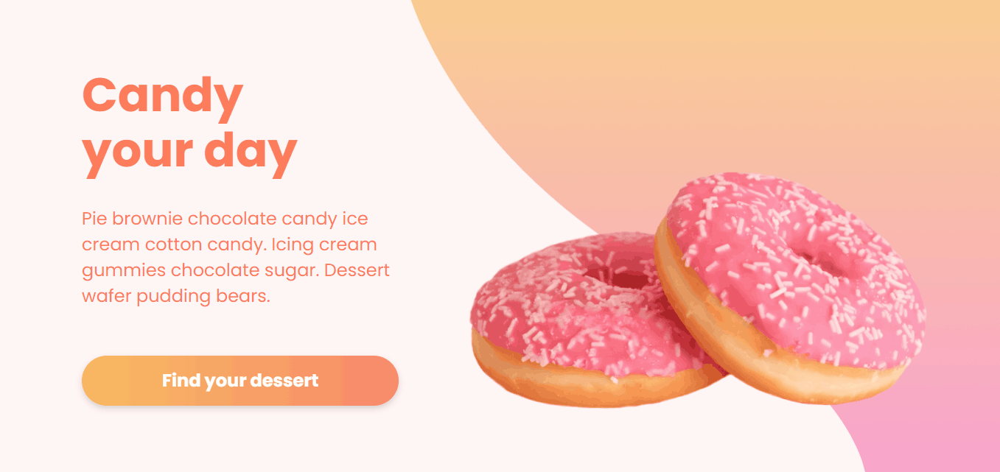

<h1 align="center">
    
</h1>

# 🍩 CandyShop: loja de doces
Este é um projeto de e-commerce de doces para reforçar os conceitos estudados sobre desenvolvimento web utilizando React e Redux.
Foi utilizada uma fake API para fornecer os dados e Redux para gerenciar e compartilhar o estado da aplicação, possibilitando, assim, a simulação de um e-commerce com carrinho de compras.

## 💻 Projeto

### Tecnologias
- React.js
- Redux
- TypeScript
- Styled-Components
- Slick Carousel

### Conhecimentos obtidos
- Utilização de Redux para gerenciamento de estados da aplicação, otimizando os ciclos de renderização e possibilitando compartilhar as informações dos produtos e do carrinho de compras entre os componentes;
- Utilização da lib Slick Carousel para criação do carrossel de produtos na página de vendas;
- Aplicação do conceito de responsividade no layout das telas.

###  Layout
O layout da aplicação está disponível no [Figma](https://www.figma.com/file/Y9G7a5bjqqHieZPhKGZeq3/CandyShop?node-id=0%3A1).

## 🔧 Executar no seu PC

- Clone esse repositório;
- Execute o comando para instalar as dependências, como `yarn`;
- Execute o comando para iniciar a fake API, por exemplo: `yarn server`;
- Execute o comando para iniciar o projeto, por exemplo: `yarn start`;
- Acesse a aplicação em <strong> `http://localhost:3000`</strong>, mude a porta caso você tiver configurado outra.

## 🤔 Como contribuir

- Faça um fork desse repositório;
- Crie uma branch com as suas alterações: `git checkout -b my-feature`;
- Commit suas alterações: `git commit -m 'feat: my new feature'`;
- Faça um push para a sua branch: `git push origin my-feature`.

## 📜 Licença

> Este projeto está sob a licença MIT. Veja o arquivo [LICENSE](https://github.com/jessicafpx/candyshop-redux/blob/main/LICENSE.md) para mais detalhes.

---

##### 
 <strong> < desenvolvido por <a href="github.com/jessicafpx"> @jessicafpx</a> /> </strong> 👋
